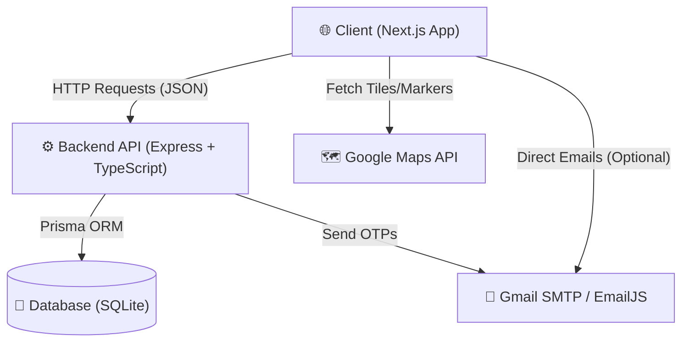

# SewaSuchak Project Stack Overview

This document provides a comprehensive overview of the technologies, frameworks, and services used in the **SewaSuchak** project.

## 🏗️ System Architecture

The following diagram illustrates how the different components of SewaSuchak interact:

---

## 🎨 Frontend Stack

The frontend is built using a modern React-based stack focused on performance and developer experience.

- **Framework**: [Next.js 16 (App Router)](https://nextjs.org/)
- **Library**: [React 19](https://react.dev/)
- **Language**: [TypeScript](https://www.typescriptlang.org/)
- **Styling**: [Tailwind CSS v4](https://tailwindcss.com/)
- **Animations**: [Framer Motion](https://www.framer.com/motion/)
- **Icons**: [Lucide React](https://lucide.dev/)
- **Maps Integration**: [Google Maps JavaScript API](https://developers.google.com/maps) (via `@react-google-maps/api`)
- **Email Services**: [EmailJS](https://www.emailjs.com/) (Client-side email handling)

---

## ⚙️ Backend Stack

The backend is a robust Node.js API serving as the central logic layer.

- **Runtime**: [Node.js](https://nodejs.org/)
- **Framework**: [Express.js](https://expressjs.com/)
- **Language**: [TypeScript](https://www.typescriptlang.org/) (Compiled via `tsc`)
- **ORM**: [Prisma](https://www.prisma.io/)
- **Authentication**:
  - [JSON Web Tokens (JWT)](https://jwt.io/) for session management.
  - [bcryptjs](https://github.com/dcodeIO/bcrypt.js) for secure password hashing.
  - **OTP Verification**: Custom logic for email-based verification.
- **File Handling**: [Multer](https://github.com/expressjs/multer) (Used for processing image and video uploads).
- **Email Services**: [Nodemailer](https://nodemailer.com/) (Configured via Gmail SMTP).

---

## 📂 Database Layer

The project uses a relational database structure managed through Prisma.

- **Database Engine**: [SQLite](https://www.sqlite.org/) (Local file-based database for development).
- **Models**:
  - `User`: Authentication and roles (Citizen, Official, Admin).
  - `Issue`: Core reporting data (Category, Location, Status, Priority).
  - `Media`: Attached images/videos for issues.
  - `Otp`: Verification codes for signups and reports.
  - `Vote` & `Comment`: Community interaction features.

---

## �️ External Services & APIs

- **Google Maps API**: Used for visualizing reported issues on a map and location picking.
- **Gmail SMTP**: Used by the backend to send OTPs and notifications.
- **EmailJS**: Secondary email service used directly from the frontend.
- **Local Storage**: Files (Images/Videos) are currently processed and managed locally via the backend.

---

## 🧠 Choice of Technologies (Rationale)

### Why this stack?

| Tool | Why we used it? |
| :--- | :--- |
| **Next.js** | Provides Server-Side Rendering (SSR) for better SEO and fast initial load times. Its App Router is the modern standard for React. |
| **TypeScript** | Used in both Frontend and Backend to catch bugs early through static typing, making the codebase more maintainable. |
| **Express.js** | A minimalist, flexible framework for Node.js that makes it easy to build RESTful APIs. |
| **Prisma** | A powerful ORM that provides type-safe database access, making it very hard to write broken queries. |
| **SQLite** | A file-based database that requires zero configuration, perfect for rapid development and local testing. |
| **JWT** | Enables stateless authentication, allowing the server to verify users without needing to store active sessions in a database. |
| **Tailwind CSS** | Allows for rapid UI development with a utility-first approach, ensuring consistent styling without writing custom CSS files. |
| **Nodemailer** | Extremely reliable for sending emails (OTPs, notifications) directly from the application logic. |

---

## 🚀 Development Tools

- **Package Manager**: `npm`
- **Dev Server**: `nodemon` & `ts-node` for automatic backend restarts.
- **UI Feedback**: Modern responsive design with dark/light mode support.
